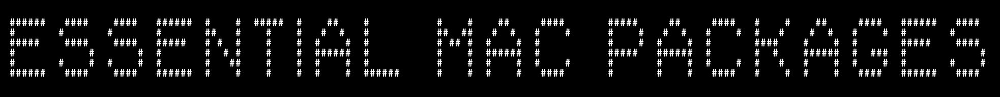

# install-mac-sh


This repository provides a reproducible, declarative way to set up a brand-new Mac for development using:

# Homebrew + Brewfile (single source of truth)

- Zsh + GitHub SSH
- Node (via nvm) + Vercel
- Python + pipx
- Docker, Postman, VS Code, Cursor

### Optional: AWS, Kubernetes, EKS, Azure

The goal:
You should be able to wipe a Mac, run one script, and be fully productive in minutes.

## What gets installed

From the Brewfile:
- Core tooling
  - git, gh, jq, curl, wget
  - fzf, ripgrep, fd, bat, direnv

- Developer toolchains
  - Python 3 + pip
  - pipx (clean Python CLI installs)
  - nvm + Corepack (Node, pnpm, yarn per-project)

- Cloud & containers
  - AWS CLI
  - Docker Desktop

- Apps
  - VS Code
  - Cursor
  - Postman

Optional:

- Kubernetes (helm, eksctl)
- Azure CLI
- Pyenv (multi-Python environments)

## Step 1 — Create your GitHub SSH config

If this is a new Mac, create an SSH config entry for GitHub:
```
Host github.com
  HostName github.com
  User git
  AddKeysToAgent yes
  UseKeychain yes
  IdentityFile ~/.ssh/id_ed25519_github
```

The bootstrap script will generate the SSH key for you and copy it to your clipboard so you can paste it into GitHub.

## Step 2 — Clone this repo
```
git clone git@github.com:rjain15/install-mac-sh.git
cd install-mac-sh
```

## Step 3 — Run the bootstrap
```
chmod +x bootstrap-mac.sh
./bootstrap-mac.sh
```

### What this does:

 - Installs Xcode Command Line Tools (if missing)
 - Installs Homebrew
 - Loads Homebrew into your shell
 - Runs brew bundle using the Brewfile
 - Creates a GitHub SSH key
 - Installs Node (LTS) via nvm
 - Installs Vercel CLI
 - Sets up Python + pipx

### When it finishes, restart your terminal.

## Managing your stack
This repo is declarative.
To add or remove tools:
 
 - Edit `Brewfile`
 - Run:
   ```brew bundle


  - Homebrew will:
    - Install missing packages
    - Skip what’s already installed
    - Remove anything no longer listed (if you use --cleanup)
    - This is how you keep multiple Macs identical.
    - Node & package managers
    -  This setup uses:
       nvm for Node versions
       corepack for yarn / pnpm
       After first run: `nvm install --lts`
       `corepack enable`


Then your projects can specify their own package manager versions automatically.

     - Python & CLIs
       Python CLIs should be installed with pipx, not pip:
```
pipx install poetry
pipx install httpie
pipx install black
```


This avoids polluting system Python.

     - Docker
     Docker Desktop is installed but not started automatically. Open Docker Desktop once after installation to complete setup.


### Why this exists

This repo exists so you never have to:
- Manually install dev tools again
- Click through random installers
- Guess what you forgot on a new Mac
- Everything lives in: Brewfile
- bootstrap-mac.sh


Your Mac becomes infrastructure as code.

If you want, next we can add:

+ 1Password / Raycast
+ Postgres + pgvector
+ Kubernetes context setup

SSH profiles for work vs personal

iTerm2 + Oh-My-Zsh / Powerlevel10k
